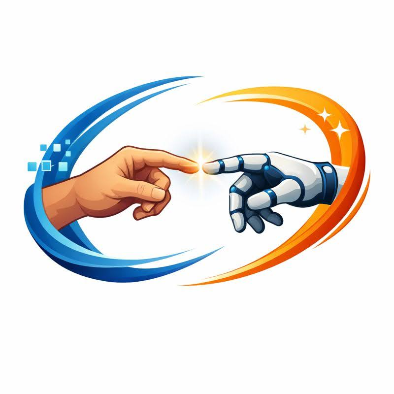
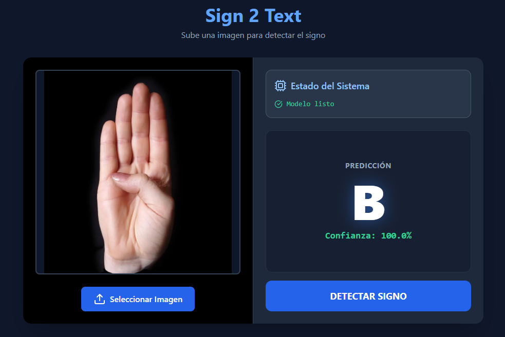

# 🧠 Proyecto final Samsung: Sign2Text

Sistema de Inteligencia Artificial capaz de detectar e interpretar el lenguaje de signos mediante imagenes indicando la letra equivalente. Este proyecto busca mejorar la accesibilidad y reducir las barreras de comunicación para personas con discapacidad auditiva.

  

---

## 📌 Descripción

Sign2Text es una solución basada en Deep Learning que reconoce gestos realizados con las manos y los traduce en texto.

El objetivo principal es crear una herramienta práctica, escalable y precisa que pueda integrarse en aplicaciones educativas, sociales o comerciales.

---
## ⚙️ USO

### Acceder a la página web y adjuntar una imagen

🌐 Web: [Sign2Text](https://sign-2-text.vercel.app/)

---

## ✨ Características principales

- ✅ Detección de manos en tiempo real  
- ✅ Reconocimiento de gestos mediante modelos de Machine Learning / Deep Learning  
- ✅ Conversión de signos a texto  
- ✅ Arquitectura modular y escalable  
- ✅ Preparado para futuras integraciones (apps, web, APIs)  
- ✅ Código limpio y fácil de mantener  

---

## 🛠️ Tecnologías utilizadas
### 🔹 Núcleo de Inteligencia Artificial

- **TensorFlow**  

- **Keras**  

- **Redes Neuronales Convolucionales (CNN)**  

---

### 🔹 Procesamiento y Análisis de Datos

- **NumPy**  

- **Pandas**  

- **Scikit-learn**

---

### 🔹 Visión por Computador y Visualización

- **OpenCV (cv2)**  

- **Scikit-image (skimage)**  

- **Matplotlib**  

---

### 🔹 Entorno de Desarrollo y Despliegue

- **Google Colab**
- 📓 Notebook: [Cuaderno Google Colab](https://colab.research.google.com/drive/1WPC1voBY2AAN6TtdEAjfhqRoqlSMX2W7?authuser=2#scrollTo=xuiCtAySln87) 

- **KaggleHub**
- 📊 Dataset: [ASL Dataset](https://www.kaggle.com/datasets/grassknoted/asl-alphabet)

- **TensorFlow.js**

- **Vercel**

---

## Reconocimiento

### Al adjuntar una imagen, se reconocerá e indicará la letra a la que corresponde.
Aunque reconoce la mayoría de imagenes, puede fallar.

  
  

## 👨‍💻 Créditos

Este proyecto ha sido desarrollado por:

- **Carlos Maranhas Gómez-Choco**
- **Yousef Arrugaeta Lakhmiri**
- **Álvaro Mora Fernández**
- **Yun Olazabal Fernández**

Gracias a nuestro trabajo, colaboración y dedicación, hemos sido capaces de crear este sistema de detección de lenguaje de signos basado en Inteligencia Artificial.

